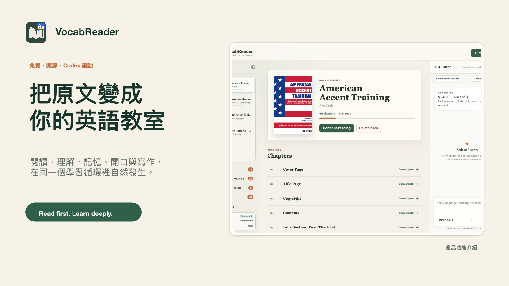

<p align="center">
  
</p>

<h1 align="center">VocabReader</h1>

<p align="center">
  <strong>Read first. Learn deeply.</strong><br />
  一個由 Codex 驅動、把 EPUB 閱讀自然接到理解、記憶與主動輸出的桌面學習閱讀器。
</p>

<p align="center">
  
  
  
  
  
</p>

<p align="center">
  <a href="https://github.com/highsunday/VocabReader/releases"><strong>查看 Releases</strong></a>
  ·
  <a href="#從原始碼啟動"><strong>立即試用</strong></a>
  ·
  <a href="https://github.com/highsunday/VocabReader/issues"><strong>回報問題</strong></a>
</p>

> [!IMPORTANT]
> VocabReader 目前是 Early Preview。macOS 與 Windows 安裝包可從 [GitHub Releases](https://github.com/highsunday/VocabReader/releases) 下載；第一版尚未簽章或 notarize，macOS Gatekeeper／Windows SmartScreen 可能顯示「發布者未驗證」警告。

## 閱讀，不該被查單字切得支離破碎

VocabReader 讓你先專心讀原文、標出真正不懂的地方，再讓 AI 只針對目前的**閱讀區段**提供有上下文的說明。值得記住的單字與片語會沉澱成**學習項目**，進入間隔複習；理解過的內容則能立刻拿來復述、跟讀與寫作。

它不是幫你把整本書翻譯完，而是保留第一次獨立閱讀的思考，讓每一次卡住都能變成下一次真正會用的能力。

<p align="center">
  <strong>閱讀 → 理解 → 收進生詞庫 → 間隔複習 → 復述、跟讀與造句</strong>
</p>

## 一套連續的語言學習循環

| 階段 | VocabReader 幫你做什麼 |
|---|---|
| **閱讀** | 導入 EPUB、選定閱讀區段、保留章節位置與進度，讓長篇閱讀更容易持續。 |
| **理解** | 標記不懂的單字、片語或句子；AI 依原文上下文集中解釋，而不是脫離語境查字。 |
| **沉澱** | 把值得記住的目標語義整理成學習項目，保存詞性、程度、搭配、例句與來源脈絡。 |
| **記憶** | 以 FSRS 安排 Anki 式間隔複習，AI 依特定語義出題、批改，再由你確認最終評級。 |
| **輸出** | 用閱讀測驗、自由復述、逐句跟讀與整合造句，把「看得懂」推進到「說得出、寫得出」。 |

## 真的在閱讀介面裡學

### 原文、閱讀範圍與 AI Tutor 同時在眼前

不用在閱讀器、字典、聊天視窗與筆記工具之間反覆切換。右側 AI Tutor 知道目前允許讀取的範圍，可以解釋標記、建立學習項目、產生閱讀測驗，或開始區段復述練習。


<table>
  <tr>
    <td width="50%" valign="top">
      <strong>語義導向的生詞庫</strong><br /><br />
      <br />
      同一個字的不同語義可以分開學；依狀態、語言與 CEFR 快速搜尋與整理。
    </td>
    <td width="50%" valign="top">
      <strong>AI 批改 × FSRS 間隔複習</strong><br /><br />
      <br />
      系統安排下一次複習，並用回想結果呈現真正的記憶變化，而不只計算打卡次數。
    </td>
  </tr>
  <tr>
    <td width="50%" valign="top">
      <strong>逐句跟讀，從短片語練到完整表達</strong><br /><br />
      <br />
      聽 AI 示範、錄下自己的聲音並反覆比較；錄音與練習狀態保留在本機。
    </td>
    <td width="50%" valign="top">
      <strong>把學過的詞放進自己的句子</strong><br /><br />
      <br />
      一次自然運用多個已複習項目，寫成短文或故事，再取得保留原意的 AI 修改建議。
    </td>
  </tr>
</table>

## 你會喜歡的細節

- **少切換工具**：書庫、閱讀、AI 對話、生詞庫、複習與輸出練習都在同一個桌面 App。
- **只教你真正卡住的地方**：先讀後問，AI 優先處理你標記的內容與目前閱讀區段。
- **記住的是這一次的語義**：學習項目保留目標語義、常用搭配、例句、程度與學習狀態，不只是孤立翻譯。
- **理解與記憶分開設計**：閱讀測驗確認當下理解；FSRS 間隔複習負責長期記憶。
- **從輸入走向輸出**：支援區段復述、逐句跟讀與多詞整合造句，不讓學習停在「看過」。
- **本機優先**：EPUB、閱讀進度、學習項目、複習紀錄與錄音保存在自己的裝置，並可手動備份與完整還原。
- **多語工作區**：目前提供英文、日文與繁體中文學習語言工作區；書庫、進度與生詞庫彼此隔離。

## 從原始碼啟動

### 需要準備

- Node.js 與 npm。
- 可執行 `codex app-server` 的 Codex 安裝，並已完成 ChatGPT／Codex 帳戶登入。
- 一本你有權使用的 EPUB 電子書。

> 核心文字 AI 功能沿用 Codex／ChatGPT 登入狀態，不需要另外貼入 OpenAI API key。只有選取朗讀與 AI 示範語音是例外：啟用時需在設定中提供自己的 OpenAI API key，並會使用 API 額度。

```bash
git clone https://github.com/highsunday/VocabReader.git
cd VocabReader
npm install
npm run dev
```

啟動後會同時執行 Electron 桌面 App 與本機 Reader Server。首次開啟時，選擇學習語言並匯入 EPUB，就可以從書籍總覽開始閱讀。

### 建置與驗證

```bash
npm run typecheck
npm test
npm run test:e2e
npm run build
```

若要在目前平台建立 installer，可使用 desktop workspace 的 `dist:mac:arm64`、`dist:mac:x64` 或 `dist:win:x64` script。正式 Release 由 GitHub Actions 在對應的原生 runner 建置。

> [!WARNING]
> Early Preview 安裝包尚未簽章。macOS Gatekeeper 與 Windows SmartScreen 可能要求你額外確認；請只從本 repository 的官方 Releases 頁面下載，並確認檔名包含正確版本、平台與架構。

## 資料與 AI 邊界

| 類型 | 處理方式 |
|---|---|
| EPUB、書庫、閱讀進度、標記、學習項目、複習紀錄 | 保存在本機 Electron user data。 |
| 跟讀錄音與 AI 示範語音 | 保存在目前裝置；不會建立雲端錄音庫。 |
| AI 解析、出題與批改 | 只在你明確操作時，把完成該動作所需的有限閱讀內容或學習項目交給 Codex。 |
| 選取朗讀與 AI 語音 | 只有你明確要求播放時，才使用你設定的 OpenAI API key 傳送所選文字。 |
| 備份 | 手動匯出為可攜 ZIP；還原會完整取代目標裝置上的學習資料，不是雲端同步。 |

## 技術組成

- Electron + React + TypeScript
- Node.js + Fastify
- SQLite 本機學習資料
- `ts-fsrs` 間隔複習排程
- Codex App Server AI 整合
- Vitest + Playwright

```text
apps/
├── desktop/   Electron main、preload、React renderer 與桌面測試
└── server/    Fastify Reader Server 與 API 邊界
```

## 一起把它變得更好

VocabReader 正在往第一個公開安裝版前進。如果你也想把原文閱讀變成真正能累積的語言能力：

- ⭐ Star 這個 repository，追蹤後續版本。
- 🐛 在 [Issues](https://github.com/highsunday/VocabReader/issues) 回報問題或提出建議。
- 🔧 Fork 專案、建立分支並送出 Pull Request。

## License

VocabReader 採用 [MIT License](LICENSE)。

<p align="center">
  <strong>從你正在讀的那一頁，開始學會真正會用的語言。</strong>
</p>
