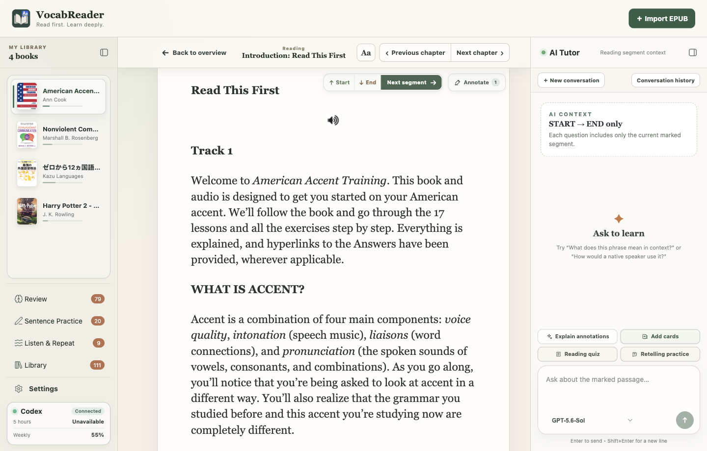
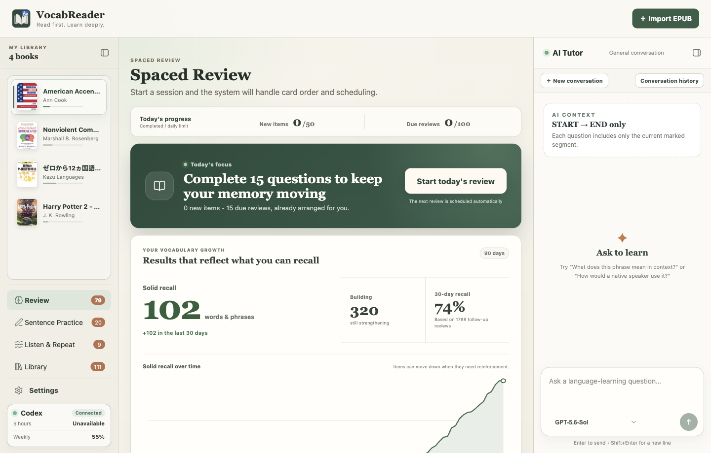
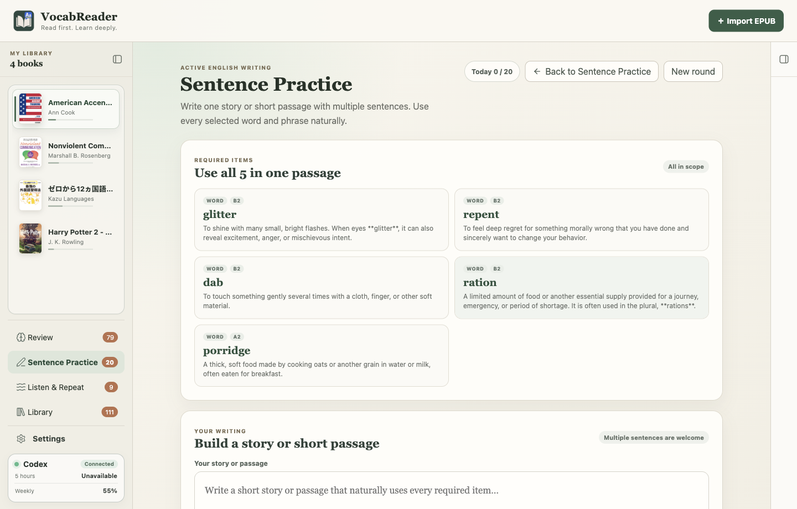
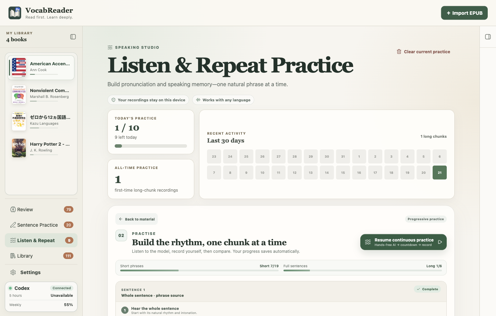

<h1 align="center">VocabReader</h1>

<p align="center">
  <strong>讓 AI 陪你讀原文，也陪你把它學會。</strong><br />
  匯入一本想讀的 EPUB。遇到不懂的地方，AI 會根據前後文解釋，<br />
  再陪你複習、跟讀、復述和寫作——不用一直切換閱讀器、字典和聊天視窗。
</p>

<p align="center">
  
  
  
  
  
</p>

<p align="center">
  <a href="https://github.com/highsunday/VocabReader/releases"><strong>下載 macOS／Windows 版本</strong></a>
  ·
  <a href="#一次閱讀走完三個學習階段"><strong>看看怎麼學</strong></a>
  ·
  <a href="https://github.com/highsunday/VocabReader/issues"><strong>提供意見</strong></a>
</p>



## 讀原文最累的，常常不是看不懂

而是每遇到一個生字，就要離開書本查字典；想問句子，又得把原文貼進 AI；好不容易看懂了，幾天後卻什麼也沒留下。

VocabReader 把這些步驟放回同一個閱讀畫面。你可以先專心讀，真的卡住時才標記內容，讓右側的 **AI Tutor 根據目前這一段原文回答**。理解之後，生詞可以直接留下來複習，剛讀完的內容也能立刻拿來測驗、復述或造句。

> **AI 不替你把書讀完，而是幫你把每一次卡住，變成下一次真的會用。**

## 一次閱讀，走完三個學習階段

### 1. 讀不懂，就在原文旁邊問

標記不懂的單字、片語或句子，AI 會結合前後文說明它在這裡的意思、語氣和用法。你不必複製貼上，也不用重新向 AI 交代自己正在讀哪一本書、哪一段話。

### 2. 看懂之後，讓它留得更久

值得學的單字和片語，可以直接整理成自己的生詞卡。VocabReader 會記住它在原文裡的特定意思，並依照你的回想狀況安排下一次複習；AI 負責出題和提供回饋，最後仍由你判斷自己是否真的記得。



### 3. 不只看得懂，還要用得出來

讀完一段後，可以請 AI 出閱讀測驗、練習不看原文復述，或把幾個學過的詞寫進同一篇短文。你也能逐句跟讀、錄下自己的聲音，從理解一路練到真正能說、能寫。



## AI Tutor 可以陪你做什麼？

| 你想做的事 | AI 如何協助 |
|---|---|
| **弄懂一句原文** | 根據目前閱讀內容，解釋單字、片語、句型和語氣。 |
| **留下值得學的詞** | 草擬意思、程度、常見搭配與例句；送進生詞庫前先讓你確認。 |
| **確認自己真的看懂** | 針對剛讀完的內容出題，而不是只給一份通用練習。 |
| **練習用自己的話表達** | 檢查復述有沒有遺漏原意，並指出可以說得更自然的地方。 |
| **把生詞用進寫作** | 指定多個學過的詞，陪你把它們自然寫進句子、短文或故事。 |

## 和把原文貼進聊天工具，有什麼不同？

| 一般的做法 | 使用 VocabReader |
|---|---|
| 每次重新複製原文、解釋背景 | AI Tutor 已經知道你指定的閱讀範圍 |
| 得到答案後，對話就結束了 | 解釋可以接著變成生詞、測驗與練習 |
| 同一個字的不同意思混在一起 | 記住這個字在這次原文中的特定意思 |
| 閱讀、背單字和寫作分散在不同工具 | 從輸入到輸出，都留在同一個學習流程 |

## 不用先研究 API，也能開始

VocabReader 本身免費、開源。如果你的 ChatGPT 帳號已經可以使用 Codex，VocabReader 會沿用本機的 Codex 登入狀態。上下文解釋、生詞整理、閱讀測驗、複習批改、復述和寫作回饋，都不需要另外申請或貼入 OpenAI API key。

> [!NOTE]
> 你需要已登入的 Codex Desktop 或 Codex CLI。只有可選的 AI 示範語音／選取朗讀功能需要自行提供 OpenAI API key；不使用這項語音功能，就不必設定 API key。

## 不只用來學英文

VocabReader 的閱讀與 AI 理解流程不綁特定語言。只要 EPUB 文字能被正常讀取，AI 就能依照上下文協助你理解。

目前完整提供 **英文、日文與繁體中文**三種獨立學習空間。每種語言都有自己的書庫、進度和生詞，不會全部混在一起。其他語言的 EPUB 也可以匯入、閱讀和詢問 AI；不過生詞分類、語音等細節，還沒有針對每一種語言逐一調整。

## 這款 App 適合你嗎？

VocabReader 適合：

- 想用小說、非虛構作品或專業書籍學習語言的人。
- 已經能讀一些原文，但常常被生字和長句打斷的人。
- 查過很多單字，卻總是過幾天就忘記的人。
- 希望 AI 幫忙理解，而不是直接把整本書翻譯完的人。
- 已有可使用 Codex 的 ChatGPT 帳號，不想再管理文字 AI API key 和用量的人。

如果你需要的是整本自動翻譯、手機 App、雲端同步，或完全離線的無 AI 閱讀器，目前的 VocabReader 可能不適合你。

<details>
<summary><strong>看看更多產品畫面</strong></summary>

### 把讀過的詞整理成自己的生詞庫

每張卡片保存的是你在原文裡遇到的意思，不只是孤立的中文翻譯。


### 從短片語開始練習跟讀

聽示範、錄下自己的聲音，再逐步練到完整句子。錄音和練習進度保存在自己的電腦。



</details>

## 三步開始使用

1. 從 [GitHub Releases](https://github.com/highsunday/VocabReader/releases) 下載 macOS Apple Silicon、macOS Intel 或 Windows 64-bit 版本。
2. 確認 Codex Desktop／CLI 已安裝，並登入能使用 Codex 的 ChatGPT 帳號。
3. 開啟 VocabReader，選擇學習語言，匯入一本你有權使用的 EPUB。

> [!IMPORTANT]
> VocabReader 目前仍是 Early Preview，安裝程式還沒有完成開發者簽章。macOS 或 Windows 第一次開啟時，可能出現「無法驗證開發者」或「發布者未驗證」的提醒。請只從本專案的官方 Releases 頁面下載，並確認檔名符合你的電腦版本。

<p align="center">
  <a href="https://github.com/highsunday/VocabReader/releases"><strong>下載 VocabReader，從下一頁原文開始學</strong></a>
</p>

<details>
<summary><strong>你的書籍和學習資料如何被使用？</strong></summary>

| 資料 | 處理方式 |
|---|---|
| EPUB、書庫、閱讀進度、標記、生詞與複習紀錄 | 保存在本機 Electron user data。 |
| 跟讀錄音與 AI 示範語音 | 保存在目前裝置，不建立雲端錄音庫。 |
| AI 解釋、出題與批改 | 只有你明確操作時，才把完成該動作所需的有限閱讀內容或學習項目交給 Codex。 |
| 選取朗讀與 AI 語音 | 只有你明確要求播放時，才使用你設定的 OpenAI API key 傳送所選文字。 |
| 備份 | 手動匯出為可攜 ZIP；還原會完整取代目標裝置的學習資料，不是雲端同步。 |

</details>

<details>
<summary><strong>從原始碼啟動與開發</strong></summary>

你需要 Node.js、npm，以及可以執行 `codex app-server` 的 Codex 安裝。

```bash
git clone https://github.com/highsunday/VocabReader.git
cd VocabReader
npm install
npm run dev
```

VocabReader 使用 Electron、React、TypeScript、Fastify、SQLite、`ts-fsrs`、Codex App Server、Vitest 與 Playwright。

```text
apps/
├── desktop/   Electron main、preload、React renderer 與桌面測試
└── server/    Fastify Reader Server 與 API 邊界
```

```bash
npm run typecheck
npm test
npm run test:e2e
npm run build
```

若要在目前平台建立 installer，可使用 desktop workspace 的 `dist:mac:arm64`、`dist:mac:x64` 或 `dist:win:x64` script。正式 Release 由 GitHub Actions 在對應的原生 runner 建置。

</details>

## 一起把 VocabReader 變得更好

- ⭐ Star 這個 repository，追蹤後續版本。
- 🐛 在 [Issues](https://github.com/highsunday/VocabReader/issues) 分享使用感受、回報問題或提出建議。
- 🔧 Fork 專案、建立分支並送出 Pull Request。

## License

VocabReader 採用 [MIT License](LICENSE)。

<p align="center">
  <strong>不只是讀完一本書，而是帶走裡面的語言。</strong>
</p>
