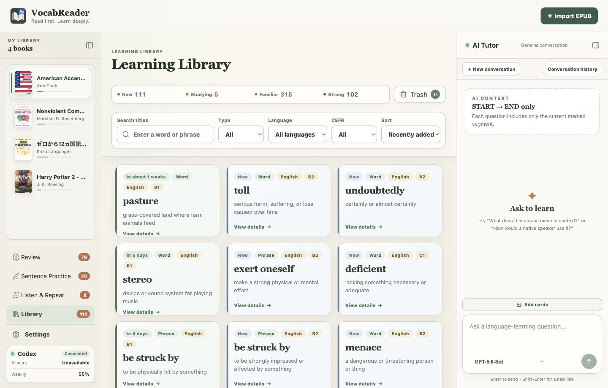
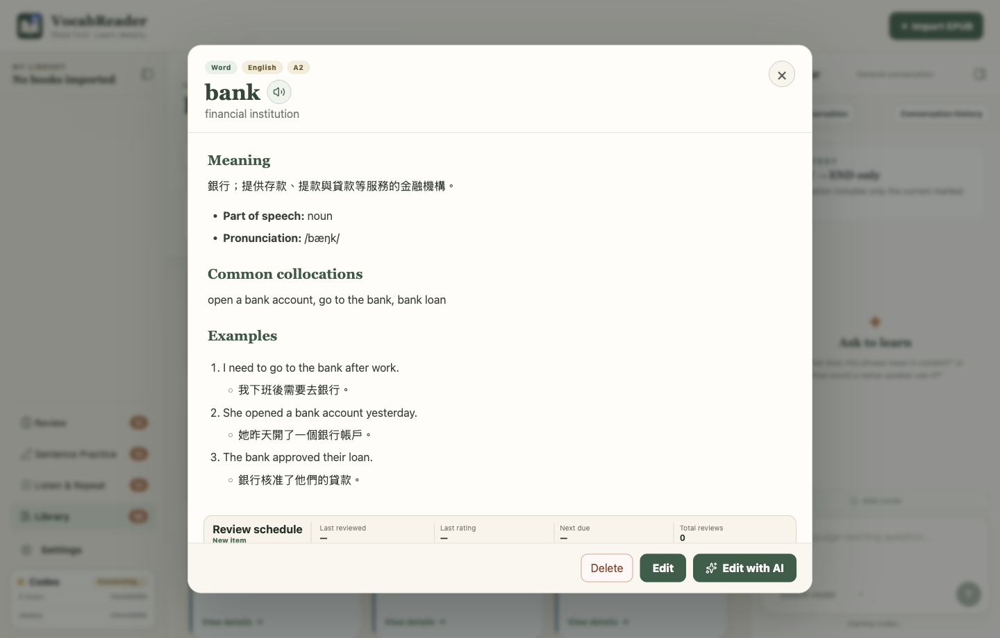

<p align="center">
  <strong>English</strong> · <a href="README.zh-TW.md">繁體中文</a>
</p>

<h1 align="center">VocabReader</h1>

<p align="center">
  <strong>Turn every moment of confusion into something you can remember and use.</strong><br />
  VocabReader is a desktop app that brings EPUB reading, AI explanations, vocabulary management, and active practice together.<br />
  Go from understanding a passage to spaced review, writing, and speaking without jumping between a reader, dictionary, chatbot, and flashcard app.
</p>

<p align="center">
  
  
  
  
  
</p>

<p align="center">
  <a href="https://github.com/highsunday/VocabReader/releases"><strong>Download for macOS or Windows</strong></a>
  ·
  <a href="#key-features"><strong>Explore the features</strong></a>
  ·
  <a href="https://github.com/highsunday/VocabReader/issues"><strong>Share feedback</strong></a>
</p>


## Make every reading session build real language ability

The frustrating part of reading in another language is not encountering an unfamiliar word. It is looking that word up, understanding it for a moment, and then forgetting it. A reader can display the book, a dictionary can define a word, a chatbot can answer a question, and a flashcard app can schedule reviews—but turning all of those scattered results into a sustainable learning process takes work.

VocabReader connects the entire flow:

**Import an EPUB → Read and mark questions → Get contextual explanations → Create learning items → Review with spaced repetition → Practise through writing and speaking**

VocabReader does not use AI to replace reading, and it is not an automatic whole-book translation tool. It preserves the process of reading and thinking for yourself, offers focused help when you ask for it, and carries the material worth learning into later practice.

### What makes it different

- **Learn with AI Tutor:** Ask about words, phrases, grammar, or meaning in the passage you are reading.
- **Save what you want to learn:** Add words and phrases from the book to your Learning Library with explanations and examples.
- **Review and practise in one app:** Use spaced review, reading exercises, writing practice, and Listen & Repeat without switching tools.
- **Keep your data on your device:** Books, reading progress, annotations, learning items, and review history are stored locally and can be backed up manually.

## Key features

### 1. Learn with AI Tutor

While reading an EPUB, ask about the current passage, the use of a word or phrase, sentence structure, or grammar. AI Tutor answers with the text you are reading in mind, so you do not have to copy the passage or explain the context each time.

You can continue with follow-up questions—for example, ask for the overall meaning first, then look more closely at the grammar or tone of one sentence. The book and AI conversation stay side by side for easy comparison.


### 2. Mark difficult text and explain it together

Mark several unfamiliar words, phrases, or complete sentences while you read. When you finish the current passage, ask AI to organise and explain them together instead of stopping for every question.

AI keeps the original order and groups the results by type:

- Words and phrases include their meaning in the passage, common usage, collocations, and examples.
- Complete sentences include sentence structure, grammar relationships, tone, and a simpler paraphrase when helpful.
- AI explains only what you marked; the surrounding text is used only for context.

Annotations stay in their original positions and remain available when you reopen the book.


### 3. Create learning cards from explanations or chat

After an annotation explanation, choose the words and phrases you want to turn into Anki-style learning cards. AI prepares card drafts for confirmation before adding them to the Learning Library, so you do not have to copy explanations or build the cards manually.

You can also ask to add a word or phrase directly from an AI conversation. VocabReader uses the current reading context to identify the meaning used in the book instead of saving only the most common dictionary definition.

Each meaning you want to learn becomes its own card with item type, CEFR level, pronunciation, common collocations, examples, and usage notes. Cards are collected in the Learning Library and enter spaced review according to their current learning state.


The Learning Library shows every card and its New, Studying, Familiar, or Strong state. You can also search, filter, sort, and check when a card is due next.



Open a card to see its full meaning, pronunciation, common collocations, examples, and review schedule. You can edit it manually or ask AI to help revise the content.



### 4. Review cards with spaced repetition

The Learning Library uses a spaced-repetition schedule to select the cards that need to be learned or reviewed today. During each review, AI uses the meaning saved on the card to write a new contextual sentence. You infer what the highlighted word or phrase means from that sentence.

The same word or phrase can appear in different sentences and situations across reviews. This shows how it works with other words and inside a complete sentence, instead of asking you to memorise the term and its translation separately.

After you submit the paper, AI checks each answer and provides an explanation and suggested answer. Choose `Forgotten`, `Hard`, `Good`, or `Easy`, and VocabReader uses that result to schedule the next review.

You can adjust the daily number of new cards, due reviews, and questions per paper. Review history and past answers are saved, and an unfinished paper can be continued later.


> [!IMPORTANT]
> **One card, one meaning**
>
> VocabReader ties each card to one specific meaning instead of putting every definition of a word on the same card. For example, `bank` as a financial institution and `bank` as the side of a river become two separate cards. Each card contains only its own meaning, collocations, and examples.
>
> During review, AI uses the meaning assigned to that card to write a contextual sentence, and you identify the meaning from the sentence. The two cards also keep separate study states and review schedules, so knowing the financial meaning does not imply that you have learned the river meaning.

### 5. Practise speaking with Listen & Repeat

Paste text into Listen & Repeat, and AI splits it into chunks based on meaning and speaking rhythm. For each chunk, play the AI model, record yourself, and listen to both recordings separately for comparison.

Start with shorter phrases before moving to complete sentences, or practise longer chunks directly. Continuous mode automatically plays the model, counts down, records, and moves to the next chunk for uninterrupted practice.

The app tracks a daily goal and completed chunks. Recordings stay on the current device. VocabReader does not currently score pronunciation automatically, and AI model speech requires your own OpenAI API key.


### 6. Write with saved vocabulary

Sentence Practice selects a group of words and phrases that have already entered review. Use every required item in one story or short passage, then submit it for AI feedback.

AI checks whether any required item is missing, whether each meaning is correct, whether word forms sound natural, and whether the grammar and collocations work. If changes are needed, keep editing and resubmit the original draft. When complete, VocabReader shows a revised version, an explanation of the changes, and how each item was used.

You can also ask AI for three example passages using the same items. The app tracks a separate daily writing goal and recent completions without changing the cards' spaced-repetition schedule.


## Read and learn in the same app

VocabReader also includes an EPUB library, chapter list, saved reading position, and reading layout settings. Reopen the app and continue from where you stopped.

Choose which part of the chapter AI can use. After reading, use the same passage for a comprehension exercise or retell it in your own words and receive feedback. These tools support the reading workflow without requiring separate study material.

VocabReader supports common text, images, tables, and lists in standard EPUB 2 and EPUB 3 files. DRM-protected books and EPUBs that depend on complex interactivity, media, or custom presentation are not guaranteed to render correctly.

## How VocabReader differs from a general AI chatbot

| General AI chatbot | VocabReader |
|---|---|
| You paste the source text and background again for every new conversation | AI Tutor uses the reading segment you explicitly define |
| Useful answers remain buried in chat history | Explanations can become learning items and continue into practice |
| Common definitions may not match the passage | Each learning item preserves the intended contextual sense |
| General chat does not manage memory scheduling | FSRS schedules the next review from confirmed recall results |
| Reading, organising, reviewing, and producing happen in separate tools | One app connects comprehension, memory, writing, and speaking |

## Text AI does not require a separate API key

VocabReader is free and open source. If your ChatGPT account has access to Codex, VocabReader reuses the local Codex sign-in. AI conversations, annotation explanations, learning-item creation and editing, spaced review, reading exercises, retelling, writing feedback, and Listen & Repeat text segmentation do not require you to create or enter a separate OpenAI API key.

> [!NOTE]
> You need a signed-in installation of Codex Desktop or Codex CLI. Only the optional AI model speech and read-selection-aloud features require your own OpenAI API key. If you do not use AI speech, no API key is needed.

## Supported learning languages

VocabReader provides separate workspaces for **English, Japanese, Traditional Chinese, and Korean**. Each language has its own book library, Learning Library, reading progress, review history, and AI conversations, so content from different languages is not mixed together.

You can set the explanation language separately. For example, you can read Japanese and receive explanations in Traditional Chinese. EPUBs in other languages can also be imported and read, but card classification, speech, and the complete practice workflow are currently designed mainly for the four languages above.


## Who VocabReader is for

VocabReader is a good fit if you:

- Want to use novels, nonfiction, or specialist books as language-learning material.
- Are frequently interrupted by unfamiliar words, phrases, complex sentences, or grammar while reading.
- Want the app to schedule future practice from actual review results instead of merely collecting vocabulary.
- Prefer building a personal learning library from real reading contexts over studying a generic word list.
- Want to practise reading comprehension, retelling, integrated writing, pronunciation, and shadowing in one place.
- Study more than one language and want each language's books, progress, and learning items kept separate.
- Have a ChatGPT account with Codex access and want to reuse that sign-in without configuring a text-AI API key.

### Current product boundaries

VocabReader is currently an Early Preview desktop app focused on active reading and practice. It does not provide automatic whole-book translation, a mobile app, live cloud sync, or fully offline AI. You can export a ZIP backup and restore it on another computer, but this is a full data-transfer mechanism—not two-way sync or a merge import.

## Install and get started

1. Download the macOS Apple Silicon, macOS Intel, or Windows 64-bit build from [GitHub Releases](https://github.com/highsunday/VocabReader/releases).
2. Make sure Codex Desktop or Codex CLI is installed and signed in with a ChatGPT account that can use Codex.
3. Open VocabReader, choose a learning language, and import an EPUB you have the right to use.

> [!IMPORTANT]
> VocabReader is currently an Early Preview, and its installers are not yet developer-signed. macOS or Windows may show an “unidentified developer,” “cannot verify developer,” or “unknown publisher” warning the first time you open it. Download only from this project's official Releases page and confirm that the filename matches your platform.

<p align="center">
  <a href="https://github.com/highsunday/VocabReader/releases"><strong>Download VocabReader</strong></a>
</p>

<details>
<summary><strong>How data is stored and transmitted</strong></summary>

| Data | How it is handled |
|---|---|
| EPUBs, book library, reading progress, annotations, Learning Library, review history, and AI conversations | Stored in local Electron user data. VocabReader does not create a cloud account. |
| Listen & Repeat material, learner recordings, and AI model audio | Stored on the current device. VocabReader does not create a cloud recording library or transcribe your voice. |
| AI explanations, question generation, grading, and text segmentation | Only when you invoke the relevant feature, the required reading segment, learning items, answers, or practice material is sent to Codex. |
| Read-selection-aloud and AI model speech | Only when you explicitly request playback, the required text is sent using the OpenAI API key you configured. |
| Backups | Books, learning items, review data, activity statistics, and shared settings can be exported manually as a portable ZIP. AI conversations, the current review paper, Listen & Repeat material, and audio are excluded. Restoring replaces the destination data completely; it is not cloud sync. |

</details>

<details>
<summary><strong>Run from source and develop</strong></summary>

You need Node.js, npm, and a Codex installation that can run `codex app-server`.

```bash
git clone https://github.com/highsunday/VocabReader.git
cd VocabReader
npm install
npm run dev
```

VocabReader uses Electron, React, TypeScript, Fastify, SQLite, `ts-fsrs`, Codex App Server, Vitest, and Playwright.

```text
apps/
├── desktop/   Electron main, preload, React renderer, and desktop tests
└── server/    Fastify Reader Server and API boundary
```

```bash
npm run typecheck
npm test
npm run test:e2e
npm run build
```

To build an installer for the current platform, use the desktop workspace's `dist:mac:arm64`, `dist:mac:x64`, or `dist:win:x64` script. Official releases are built by GitHub Actions on the corresponding native runners.

</details>

## Contributing

- Star this repository to follow future releases.
- Report problems or propose ideas in [Issues](https://github.com/highsunday/VocabReader/issues).
- Fork the project, create a branch, and open a pull request.

## License

VocabReader is available under the [MIT License](LICENSE).
