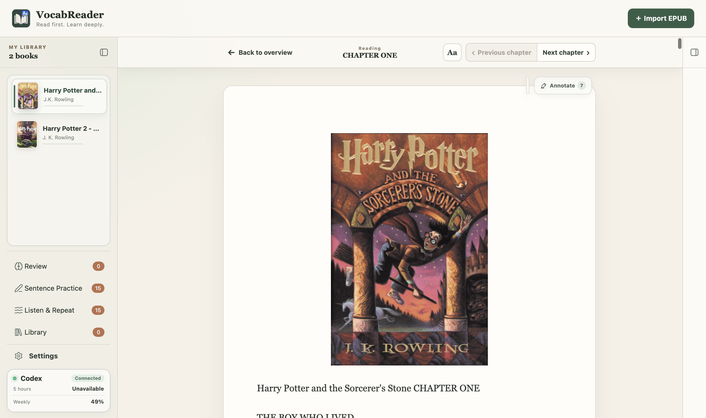
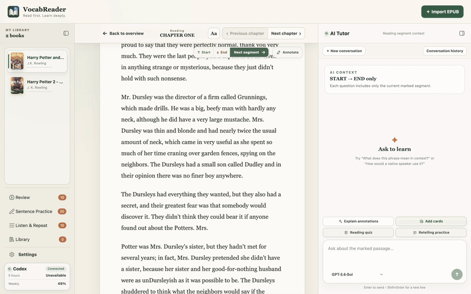
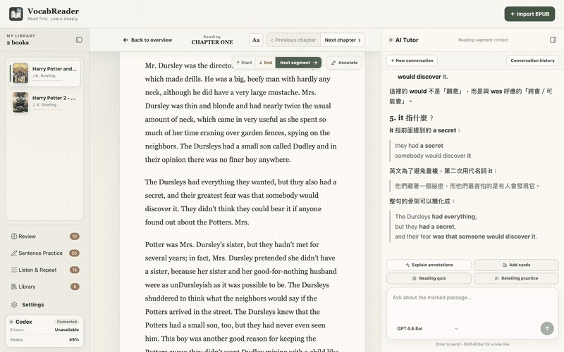
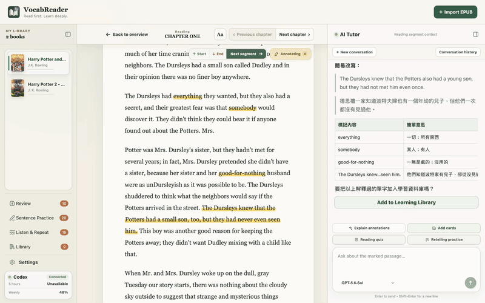
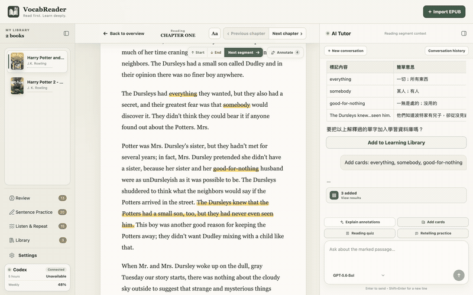
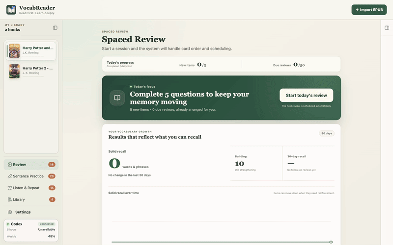
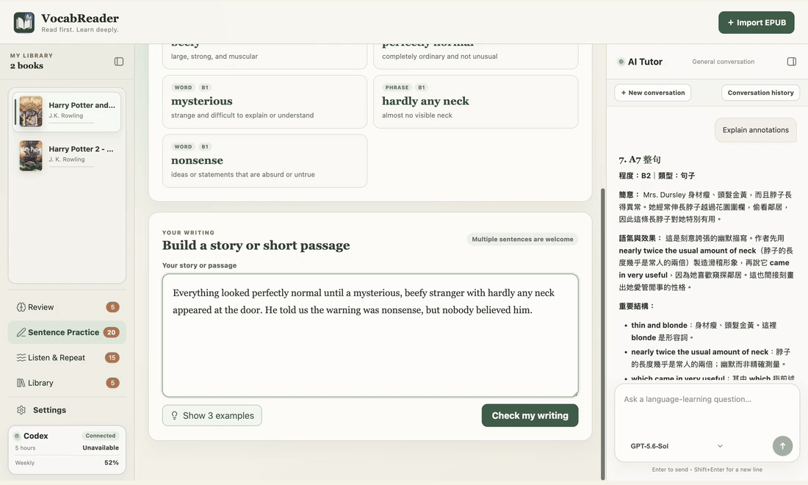
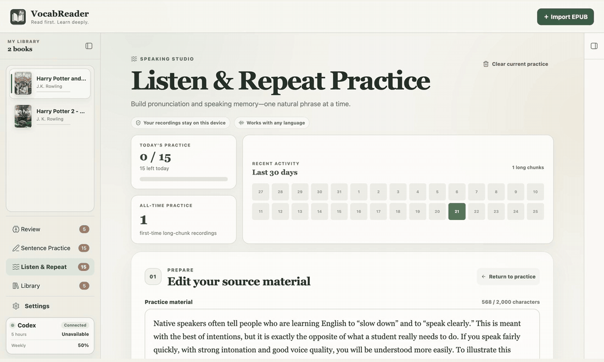
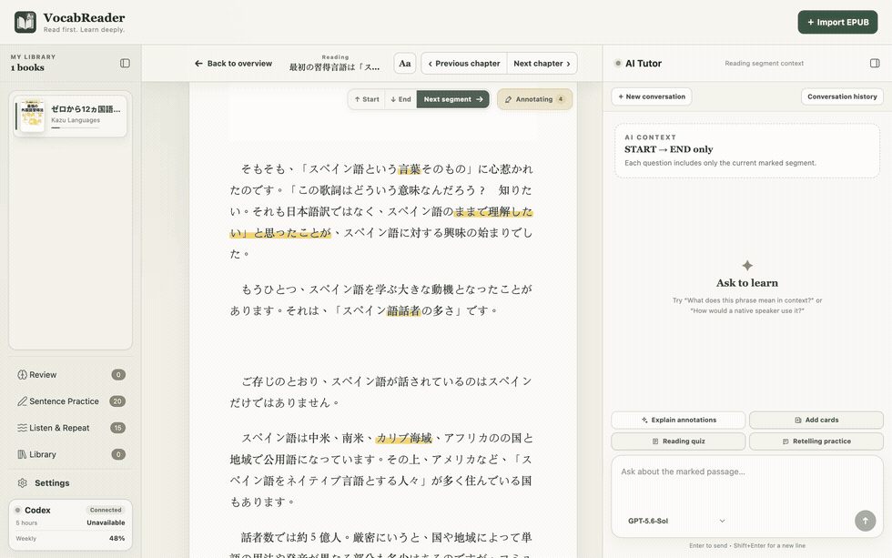
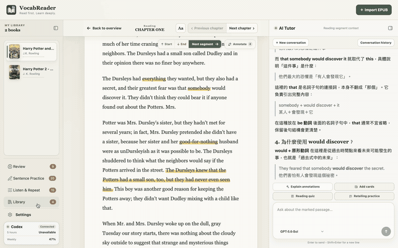

<p align="center">
  <a href="README.md">English</a> · <strong>繁體中文</strong>
</p>

<h1 align="center">VocabReader</h1>

<p align="center">
  <strong>把每一次讀不懂，變成真正記得住、用得出的學習內容。</strong><br />
  VocabReader 是結合 EPUB 閱讀、AI 講解、生詞管理與主動練習的桌面 App。<br />
  從理解原文到間隔複習、造句與跟讀，不必在閱讀器、字典和卡片工具之間來回切換。
</p>

<p align="center">
  
  
  
  
  
</p>

<p align="center">
  <a href="https://github.com/highsunday/VocabReader/releases"><strong>下載 macOS／Windows 版本</strong></a>
  ·
  <a href="#主要功能"><strong>查看主要功能</strong></a>
  ·
  <a href="https://github.com/highsunday/VocabReader/issues"><strong>提供意見</strong></a>
</p>



## 讓閱讀真正累積成語言能力

閱讀原文最可惜的情況，不是遇到不會的字，而是當下查懂之後很快又忘記。一般閱讀器可以顯示書籍，字典可以提供釋義，聊天工具可以回答問題，卡片 App 可以安排複習；但這些資訊分散在不同地方，整理成本往往高到讓學習停在「查過」而沒有變成「學會」。

VocabReader 把這段流程接在一起：

**匯入 EPUB → 閱讀並標記疑問 → 取得上下文講解 → 建立學習項目 → 間隔複習 → 造句與跟讀**

它不是用 AI 取代閱讀，也不是替使用者自動翻譯整本書。設計重點是保留自己閱讀與思考的過程，只在需要時取得針對性的幫助，再把真正值得學的內容帶進後續練習。

### 核心特色

- **解釋不脫離原文**：AI 會根據目前書籍、章節與閱讀區段理解單字、片語、句型和上下文，而不是只給一個孤立的字典答案。
- **查詢結果可以繼續使用**：有價值的解釋能整理成學習項目，保留本文語義，接著進入複習與輸出練習。
- **理解、記憶與運用彼此銜接**：閱讀測驗確認當下理解，間隔複習鞏固長期記憶，造句與跟讀則把被動辨認轉成主動使用。
- **學習資料以本機為主**：書籍、進度、標記、生詞庫和複習紀錄保存在目前裝置，並可手動匯出完整備份。

## 主要功能

### 1. 建立自己的 EPUB 學習書庫

匯入 EPUB 後，VocabReader 會整理書名、作者、封面、章節與子章節，讓小說、非虛構作品或專業讀物都能成為長期使用的學習材料。每本書會保留目前章節、閱讀位置、閱讀區段與標記，重新開啟 App 或切換書籍後可以從上次的位置繼續。

閱讀畫面可調整字級、內文寬度與行距。章節原文和 AI Tutor 並列顯示，因此詢問、對照與繼續閱讀都留在同一個工作空間，不需要複製整頁文字到其他服務。

> VocabReader 支援標準 EPUB 2／3 的常見文字、圖片、表格與清單。受 DRM 保護的內容，以及依賴複雜互動、影音或自訂排版的 EPUB，不保證能完整呈現。

### 2. 控制 AI 可以讀取的上下文

每個章節都能用 `START`／`END` 範圍標籤界定目前的閱讀區段。AI 對話、標記講解、閱讀測驗與復述練習只使用這個範圍內的原文，不會把尚未讀到的同章內容混進回答，也能避免一次送出過長的章節。

使用者可以針對段落意思、單字在本文中的語義、句子結構、文法、語氣或作者表達方式自由提問。AI Tutor 會結合目前閱讀脈絡回答，也能保留多輪對話，方便從初步解釋繼續追問細節。



### 3. 集中標記與講解真正不懂的地方

閱讀時可以直接劃線標記不熟悉的單字、片語或完整句子。標記會保存原文位置，不必在第一次遇到問題時立刻離開文章查詢，也不需要手動整理一串零散問題。

完成一個閱讀區段後，AI 可以一次整理區段內的所有標記，依類型和原文順序說明：

- 單字在本文中的意思、詞性、常見搭配、發音或易錯用法。
- 可重複使用的片語、固定表達與文法單位。
- 長句的句法結構、文法關係、語氣，以及較容易理解的改寫。
- 各項內容在目前語境中的 CEFR 程度與精簡複習提示。

AI 只把未標記的內容當作理解上下文，不會無差別講解或翻譯整個區段。這讓說明更集中，也保留使用者先自行閱讀、再處理困難點的節奏。



### 4. 把值得記住的內容收進生詞庫

標記講解完成後，可以選擇把其中的單字與可重複使用的片語加入生詞庫（Learning Library）。AI 會先產生草稿供確認，避免把整句分析、不相關內容或重複項目直接寫入。也可以在 AI 對話中用自然語言提出新增需求，不必依賴固定指令格式。

每個學習項目不只保存表面翻譯，還能記錄：

- 從原文上下文判斷的目標語義與內容類型；同一個詞的不同意思可以分開保存。
- CEFR 程度、詞性或片語類型、發音與常見搭配。
- 三到五個自然例句，以及真正有助長期使用的語氣、用法或常見錯誤提醒。
- 可選的學習注意事項與代表圖片，以及目前學習狀態、複習次數和下次到期時間。

已建立的項目可以查看詳情、請 AI 協助修改，或移到垃圾桶。生詞庫也會顯示待開始、學習中、今日到期與已穩定掌握等狀態，讓累積的內容不會變成難以整理的清單。





### 5. 用 AI 試卷與 FSRS 安排間隔複習

生詞庫中的項目會依 FSRS 排程進入複習，不需要手動判斷每天該看哪些內容。系統從新項目與到期項目組成一份複習試卷，AI 再依每個項目的目標語義產生新的情境句，避免只靠背誦原本卡片的固定版面。

作答時，使用者需要回想目標詞在句子中的意思。提交整份試卷後，AI 會逐題判斷語義是否掌握、說明表達問題並提供參考答案；使用者再依實際感受確認 `Forgotten`、`Hard`、`Good` 或 `Easy`。只有確認後，系統才會寫入複習歷史並更新下一次到期時間。

每日新項目上限、到期複習上限與每份試卷題數可以調整。複習進度、歷史答案與穩定掌握成果都會保留，尚未完成的複習也能在背景生成後繼續。



### 6. 用閱讀測驗與復述確認自己真的理解

讀完目前區段後，可以直接產生選擇題與問答題。題目以閱讀區段為範圍，用來檢查內容理解、推論與細節，而不是測試孤立的單字。提交後會得到逐題批改與整體回饋。

區段復述則要求使用者用原文語言、自己的話重新組織內容。AI 會針對遺漏、誤解、組織與語言表達提供分項回饋，讓閱讀從「看起來懂」進一步變成能主動提取與表達。這些區段練習不會改動生詞的間隔複習排程。

### 7. 使用已學內容完成整合造句

Sentence Practice 會從已經開始複習的學習項目中抽出一組必要用詞。使用者需要在同一篇故事或短文中自然使用全部項目，讓分散的單字和片語進入真實語境，而不是各寫一個互不相關的例句。

AI 會檢查是否遺漏必要用詞、是否使用正確語義、詞形是否自然，以及整篇文章的文法與搭配。若有問題，可以保留原稿修改後重送；全部符合後，會得到完整修正版、逐項修改說明與每個必要用詞在文中的實際用法。需要靈感時，也可以請 AI 產生同一組用詞的多篇參考範例。

造句練習有獨立的每日目標、累計成果與最近 30 天活動統計，但不會修改 FSRS 排程；「記得這個詞」和「能在寫作中運用」因此可以分開追蹤。



### 8. 用逐句跟讀練習發音、節奏與流暢度

Listen & Repeat 可以使用自行貼上的任意語言文本。AI 會依自然語意與韻律切分練習範圍，使用者再逐段播放 AI 示範、錄下自己的聲音並回放比較。

提供兩種練習方式：

- **Progressive**：先練較短片段，完成後再挑戰完整長片段，適合建立節奏與發音穩定度。
- **Advanced**：直接以完整句子或自然長片段練習，適合已有一定口說基礎的使用者。

除了手動逐段操作，也能使用 Continuous mode 依序完成播放示範、倒數、錄音、保存與前往下一段。系統會記錄每日目標、累計完成量和近期活動；錄音與 AI 示範音訊保存在目前裝置。

目前版本著重於聽辨、自我錄音與 A/B 回放，不會轉錄使用者語音，也不會產生自動發音分數。AI 示範語音需要使用者自行設定 OpenAI API key。



### 9. 為不同學習語言保留獨立空間

VocabReader 完整提供 **英文、日文、繁體中文與韓文** 四種學習語言工作區。每個工作區都有自己的書庫、生詞庫、AI 對話、閱讀進度、複習排程與練習狀態，切換語言時不會把不同語言的資料混在一起。

講解語言可以和學習語言分開設定。例如閱讀日文時，可以選擇用繁體中文取得解釋；閱讀測驗與復述仍以正在學習的語言進行。其他語言的 EPUB 也可以嘗試匯入、閱讀和詢問 AI，但卡片分類、語音與完整學習流程尚未針對每種語言最佳化。





## 與一般 AI 聊天工具的差異

| 一般 AI 聊天工具 | VocabReader |
|---|---|
| 每次提問都要重新貼上原文與背景 | AI Tutor 直接使用明確界定的目前閱讀區段 |
| 回答結束後，內容留在聊天紀錄裡 | 解釋可以轉成學習項目並進入後續練習 |
| 容易得到與本文無關的常見釋義 | 學習項目保存該詞在來源原文中的目標語義 |
| 一般對話不負責記憶排程 | FSRS 依實際複習結果安排下一次出現時間 |
| 閱讀、整理、複習與輸出分散 | 同一個 App 串起理解、記憶、寫作與跟讀 |

## 文字 AI 不需要另外設定 API key

VocabReader 是免費開源軟體。如果你的 ChatGPT 帳號可以使用 Codex，VocabReader 會沿用本機的 Codex 登入狀態。AI 對話、標記講解、建立與修改學習項目、間隔複習、閱讀測驗、復述、造句批改，以及跟讀文本切分，都不需要另外申請或輸入 OpenAI API key。

> [!NOTE]
> 你需要已登入的 Codex Desktop 或 Codex CLI。只有可選的 AI 示範語音／選取朗讀功能需要自行提供 OpenAI API key；不使用這項語音功能，就不必設定 API key。

## 適用情境

VocabReader 適合以下需求：

- 想用小說、非虛構作品或專業書籍作為語言學習材料的人。
- 閱讀原文時經常被生字、片語、複雜長句或文法中斷的人。
- 不想只收藏生詞，而是希望系統依實際複習結果安排後續練習的人。
- 想從真實閱讀脈絡建立自己的學習內容，而不是使用通用單字表的人。
- 想同時練習閱讀理解、復述、整合造句、發音與跟讀的人。
- 同時學習多種語言，希望書籍、進度與生詞彼此隔離的人。
- 已有可使用 Codex 的 ChatGPT 帳號，希望沿用登入狀態而不另外設定文字 AI API key 的人。

### 目前的產品邊界

VocabReader 目前是桌面版 Early Preview，專注於使用者主動閱讀與練習，因此不提供整本自動翻譯、手機 App、即時雲端同步或完全離線的 AI 功能。資料可以手動匯出為 ZIP 備份，再到另一台裝置完整還原；這是資料移轉機制，不是雙向同步或合併匯入。

## 安裝與使用

1. 從 [GitHub Releases](https://github.com/highsunday/VocabReader/releases) 下載 macOS Apple Silicon、macOS Intel 或 Windows 64-bit 版本。
2. 確認 Codex Desktop／CLI 已安裝，並登入能使用 Codex 的 ChatGPT 帳號。
3. 開啟 VocabReader，選擇學習語言，匯入一本你有權使用的 EPUB。

> [!IMPORTANT]
> VocabReader 目前是 Early Preview，安裝程式尚未完成開發者簽章。macOS 或 Windows 第一次開啟時，可能出現「無法驗證開發者」或「發布者未驗證」的提醒。請從本專案的官方 Releases 頁面下載，並確認檔名符合你的電腦版本。

<p align="center">
  <a href="https://github.com/highsunday/VocabReader/releases"><strong>下載 VocabReader</strong></a>
</p>

<details>
<summary><strong>資料儲存與傳送方式</strong></summary>

| 資料 | 處理方式 |
|---|---|
| EPUB、書庫、閱讀進度、標記、生詞庫、複習紀錄與 AI 對話 | 保存在本機 Electron user data，不建立 VocabReader 雲端帳號。 |
| 跟讀素材、使用者錄音與 AI 示範語音 | 保存在目前裝置，不建立雲端錄音庫，也不轉錄使用者語音。 |
| AI 解釋、出題、批改與文本切分 | 只有執行相關功能時，才把該操作需要的閱讀區段、學習項目、作答或練習文本傳送給 Codex。 |
| 選取朗讀與 AI 示範語音 | 只有明確要求播放時，才使用使用者設定的 OpenAI API key 傳送需要朗讀的文字。 |
| 備份 | 手動匯出書庫、生詞庫、複習資料、活動統計與共用設定為可攜 ZIP；AI 對話、目前試卷、跟讀素材與音訊不包含在內。還原會完整取代目標裝置資料，不是雲端同步。 |

</details>

<details>
<summary><strong>從原始碼啟動與開發</strong></summary>

你需要 Node.js、npm，以及可以執行 `codex app-server` 的 Codex 安裝。

```bash
git clone https://github.com/highsunday/VocabReader.git
cd VocabReader
npm install
npm run dev
```

VocabReader 使用 Electron、React、TypeScript、Fastify、SQLite、`ts-fsrs`、Codex App Server、Vitest 與 Playwright。

```text
apps/
├── desktop/   Electron main、preload、React renderer 與桌面測試
└── server/    Fastify Reader Server 與 API 邊界
```

```bash
npm run typecheck
npm test
npm run test:e2e
npm run build
```

若要在目前平台建立 installer，可使用 desktop workspace 的 `dist:mac:arm64`、`dist:mac:x64` 或 `dist:win:x64` script。正式 Release 由 GitHub Actions 在對應的原生 runner 建置。

</details>

## 參與專案

- Star 這個 repository 以追蹤後續版本。
- 在 [Issues](https://github.com/highsunday/VocabReader/issues) 回報問題或提出建議。
- Fork 專案、建立分支並送出 Pull Request。

## License

VocabReader 採用 [MIT License](LICENSE)。
